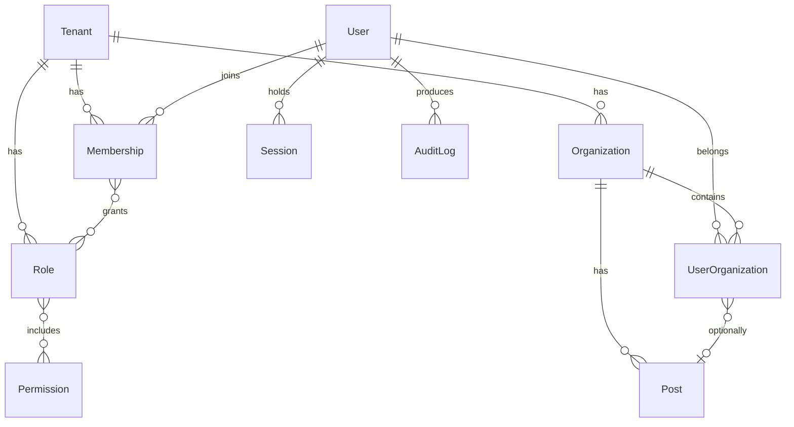
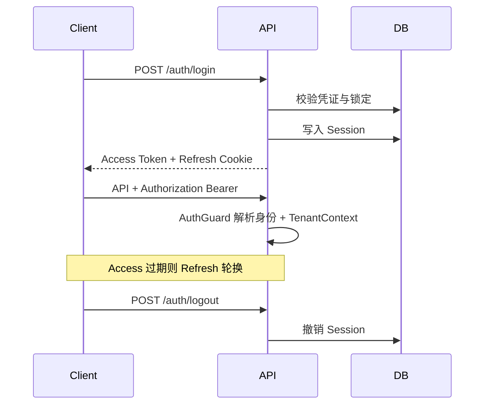

# 领域与安全（Domain & Security）

> 状态：设计基线  
> 相关：[平台总览](./platform-overview.md) · [插件系统](./plugin-system.md) · [ADR-002](../adr/002-tenant-readiness.md) · [功能清单](../product/feature-catalog.md)

## 1. 设计原则

1. **Tenant-ready**：所有租户相关数据带 `tenantId`；第一阶段使用默认租户，查询与唯一约束按租户隔离设计。
2. **身份 ≠ 授权 ≠ 归属**：User 管登录身份；Role/Permission 管能做什么；Organization 管在哪、DataScope 看什么。
3. **前后端双重授权**：前端隐藏仅 UX；后端 Guard + DataScope 为强制边界。
4. **权限码唯一真相**：菜单、按钮、API、Agent Tool 共用 `{domain}:{resource}:{action}`。
5. **最小审计**：认证失败、授权失败、敏感写操作、权限变更必须留痕。

## 2. 核心领域模型



### 2.1 Tenant

| 字段 | 说明 |
|------|------|
| `id` | 租户 ID |
| `code` / `name` | 编码与名称 |
| `status` | ACTIVE / FROZEN / EXPIRED |
| `settings` | Json，租户级配置 |

第一阶段：种子一条 `default` 租户；应用启动注入默认 `tenantId`。管理 UI 延后到多租户阶段。

### 2.2 User 与 Membership

- **User**：全局登录主体（username/email/phone、密码哈希、锁定状态）。可跨租户存在（为未来 SaaS 预留）。
- **Membership**：`(tenantId, userId)` 唯一；承载租户内状态、显示名覆盖、入驻时间。
- 角色绑定在 **Membership ↔ Role**（租户内），而非裸 User ↔ Role，避免跨租户权限泄漏。

第一阶段可简化实现为：单租户下 Membership 对每个 User 自动 1:1，API 表面仍可暴露「用户」概念。

### 2.3 Organization / Post

- **单树组织**：`type = COMPANY | DEPARTMENT | TEAM`，废弃并行 Department 表。
- **物化路径**：`path`（如 `/t1/root/eng/be/`）、`level`；子树查询 `path LIKE prefix%`。
- **UserOrganization**：主职 `isPrimary`；可选 `postId`；时间窗 `joinedAt` / `leftAt`。
- **Post**：挂在组织下的岗位，不单独承担权限（权限仍归 Role）。

### 2.4 Role / Permission / DataScope

**Permission**

| 字段 | 说明 |
|------|------|
| `code` | 唯一，`system:user:list` |
| `name` / `module` / `description` | 展示与分组 |
| `tenantId` | 可空表示平台内置；租户自定义权限带租户 |

**Role**

| 字段 | 说明 |
|------|------|
| `tenantId` | 所属租户 |
| `code` / `name` / `isSystem` | 系统角色保护 |
| `dataScope` | 见下表 |
| `customOrgIds` | CUSTOM 时使用 |

**DataScope 枚举**

| 值 | 含义 |
|----|------|
| `ALL` | 租户内全部数据 |
| `ORG_AND_CHILD` | 主职组织及下级（按 path） |
| `ORG` | 仅主职组织 |
| `SELF` | 仅本人创建 / 负责 |
| `CUSTOM` | `customOrgIds` 白名单 |

多角色时：功能权限取**并集**；DataScope 取**最宽**（可配置，默认最宽，需在实现中固定并文档化）。

### 2.5 Session / AuditLog

- **Session**：refresh token 哈希、设备信息、过期、撤销标记；强制下线即撤销。
- **AuditLog**：`tenantId`、`actorId`、`action`、`resource`、`resourceId`、`ip`、`ua`、`traceId`、`diff`、`createdAt`。

## 3. 认证（AuthN）



要求：

- Access 短时；Refresh HttpOnly + Secure + 轮换。
- 登录失败计数与锁定；写登录日志。
- MFA（TOTP）开启后，登录增加第二步。
- 密码变更 / 重置：撤销该用户全部 Session。

## 4. 授权（AuthZ）

### 4.1 功能权限

1. 登录后加载 Membership 的角色 → 权限码集合（可缓存，变更失效）。
2. **后端**：`@RequirePermission('system:user:update')` + `PermissionGuard`。
3. **前端**：路由 `staticData.permissions` + `beforeLoad`；按钮 `Can` 组件。
4. **Agent Tool**：执行前校验同一权限码。

### 4.2 数据权限

统一入口（禁止业务手写散落 if）：

```ts
applyDataScope(ctx, {
  orgIdField: 'organizationId',
  orgPathField: 'organizationPath',
  ownerField: 'createdBy',
})
```

映射：

| DataScope | 过滤 |
|-----------|------|
| ALL | `tenantId = ctx.tenantId` |
| ORG | `orgId IN ctx.orgIds` |
| ORG_AND_CHILD | `orgPath startsWith ctx.primaryOrgPath` |
| SELF | `ownerField = ctx.userId` |
| CUSTOM | `orgId IN ctx.customOrgIds` |

### 4.3 权限变更失效

- 角色权限 / 用户角色 / 调岗变更 → 发布领域事件 → 使权限缓存失效。
- Access Token 内可放权限版本号 `permVer`；不匹配则强制刷新上下文。

## 5. Tenant Context

每个请求必须建立：

```ts
{
  tenantId: string
  userId: string
  membershipId: string
  orgIds: string[]
  primaryOrgId?: string
  primaryOrgPath?: string
  permissions: string[]
  dataScope: DataScope
  customOrgIds?: string[]
  permVer: number
  traceId: string
}
```

规则：

- Repository / Query 默认注入 `tenantId`；禁止无租户裸查（超管跨租户工具需显式 API 与审计）。
- 缓存键、文件路径、任务载荷、事件 envelope **必须含 tenantId**。
- 唯一约束形如 `@@unique([tenantId, code])`。

## 6. 安全基线清单

| 项 | 要求 |
|----|------|
| 传输 | HTTPS；Cookie Secure |
| 密钥 | 环境变量注入；禁止入库明文 |
| 限流 | 登录、刷新、验证码、写接口 |
| 脱敏 | 手机号、证件默认脱敏；审计可记哈希 |
| 二次确认 | 删除、权限变更、强制下线 |
| CORS / CSRF | 按部署域收紧；Refresh 走 Cookie 时防 CSRF |
| 依赖 | CI 锁定与漏洞扫描（Phase 5 强化） |

## 7. 与现有模型的对齐说明

当前 Prisma 已有 User / Role / Permission / Organization / Session / Membership 等。重构方向：

1. 引入 `Tenant` + `Membership`，角色绑定迁到租户内（阶段内 Membership 已落地，角色仍经 UserRole）。
2. **合并 Department → Organization.type**（已完成，见 department-deprecation）。
3. 补齐 Session、AuditLog、权限版本（Session / AuditLog 已落地）。
4. 在查询层真正 enforcement DataScope（用户列表 / 组织树已接入）。

迁移细节在实施阶段单独出 migration 方案，不阻塞本设计。

## 8. 验收要点

- [ ] 无权限用户调用 API 返回 403
- [ ] DataScope=SELF 的用户看不到他人单据
- [ ] 调岗后子树数据可见范围正确变化
- [ ] 强制下线后 Refresh 失败
- [ ] 审计可还原「谁给谁赋了什么权」
