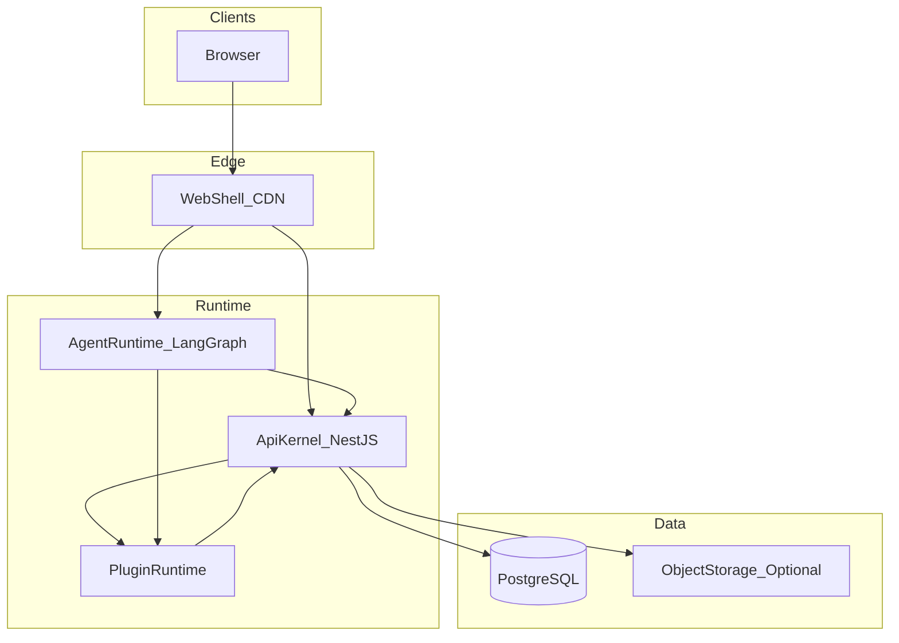
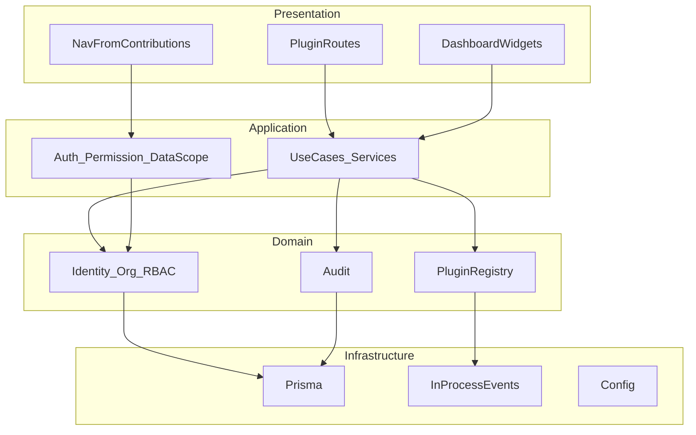

# 平台总览（Platform Overview）

> 状态：设计基线  
> 相关：[领域与安全](./domain-and-security.md) · [插件系统](./plugin-system.md) · [仓库结构](./repository-structure.md) · [ADR-001](../adr/001-plugin-runtime-model.md)

## 1. 目标

构建**平台基础 + 插件系统**：

- **平台内核**：身份、授权、组织、配置、审计、插件运行时——不可替代、不业务化。
- **插件**：一切可替换的业务与能力扩展，通过 Manifest 贡献到壳层。
- **形态**：模块化单体（Modular Monolith）+ Turborepo monorepo；第一阶段编译期插件。

## 2. 运行时拓扑



| 组件 | 职责 |
|------|------|
| **Web Shell** | 布局、路由聚合、菜单、权限 UI、插件前端贡献宿主 |
| **API Kernel** | HTTP API、认证授权、领域服务、插件 Module 聚合、OpenAPI |
| **Agent Runtime** | LangGraph 图、Tool 注册、Copilot 中间件 |
| **Plugin Runtime** | Manifest 加载（编译期静态聚合）、贡献点注册表、生命周期 |
| **PostgreSQL** | 唯一主数据存储（第一阶段） |
| **Object Storage** | 内核存储适配器；Docker 私有化 MinIO（S3 兼容），预签名直传 |

> Redis / 消息队列：**预留**，仅在多实例、任务吞吐、会话集中撤销等触发条件满足后引入（见 [roadmap Phase 5](../implementation/roadmap.md)）。

## 3. 逻辑分层



**依赖方向（强制）**：`presentation → application → domain ← infrastructure`  
禁止：插件互相深度引用内部实现；业务插件依赖另一业务插件的私有路径。

## 4. 核心 vs 插件边界

| 属于内核（kernel） | 属于插件（plugin） |
|--------------------|--------------------|
| 登录会话、Tenant Context | 通知、异步任务 |
| 文件上传、对象存储、附件引用 | 文件管理器级产品能力（分享外链等，若后续需要） |
| User / Org / Role / Permission | Webhook、报表、SSO |
| PermissionGuard、DataScope 过滤 | 垂直业务（BIM、GIS、行业模块） |
| 菜单 Shell、路由聚合算法 | 具体业务页面与 API |
| 审计日志写入 API | AI 业务 Tool / 场景 Agent |
| Plugin SDK + Runtime | 参考插件与能力插件本身 |
| 系统字典 | 通道配置（邮件/OSS 等） |

判定原则：**若拆掉该能力后平台无法安全托管任意插件，则属内核；否则做成插件。**

## 5. 请求主路径

```text
Browser
  → Web Shell（路由 beforeLoad 权限）
  → API Kernel（AuthGuard → PermissionGuard → TenantContext）
  → UseCase / Repository（applyDataScope）
  → PostgreSQL
  → Audit / Domain Event（进程内）
  → Response（含 TraceId）
```

Agent 路径：

```text
Copilot / Chat
  → Agent Runtime（graph + tools）
  → 调用 API（Bearer Token，经 OpenAPI Client）
  → 同主路径授权与 DataScope
  → Tool UI（前端贡献点渲染）
```

## 6. 部署拓扑（第一阶段）

```text
┌──────────────┐      ┌──────────────┐      ┌─────────────┐
│  web (静态)  │─────▶│  api (:3xxx) │─────▶│ PostgreSQL  │
└──────────────┘      └──────┬───────┘      └─────────────┘
                             │
                      ┌──────▼───────┐
                      │ agent (:3600)│
                      └──────────────┘
```

- 单区域、单实例即可验证平台能力。
- 容器化与多实例在 Phase 5；无状态 API 为前提，会话撤销策略需同步升级。

## 7. 共享契约

| 包 | 职责 |
|----|------|
| `@zen/shared` | Zod schema、DTO 类型、权限码常量、分页协议 |
| `@zen/plugin-sdk` | Manifest 类型、贡献点接口、生命周期、注册表 |
| `@zen/ui` | 设计系统组件（Shell 与插件共用） |
| `@zen/request` | HTTP 客户端与中间件管道 |

契约策略详见 [contracts-and-events](./contracts-and-events.md)。

## 8. 非目标（本阶段）

- 微服务拆分 API Kernel
- 第三方插件市场与代码沙箱
- 多区域多活
- 自研 BPM / 低代码平台

## 9. 成功标准

1. 新业务可通过**一个插件包**贡献前后端与权限，而无需改 Shell 核心代码（仅改聚合注册表/构建清单）。
2. 无权限用户无法通过 UI 绕过，也无法通过 API / Agent Tool 绕过。
3. 文档、OpenAPI、权限码、菜单来源一致，无硬编码双源。
