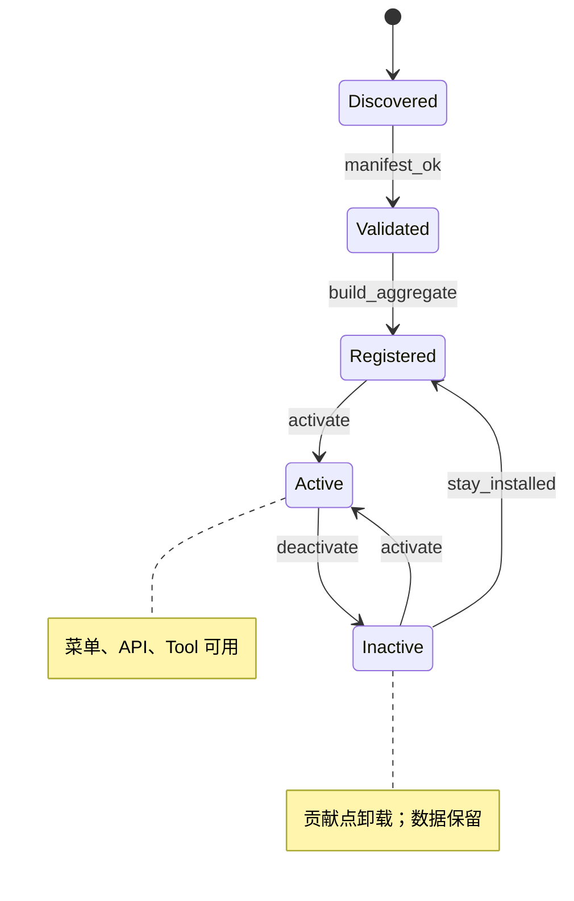
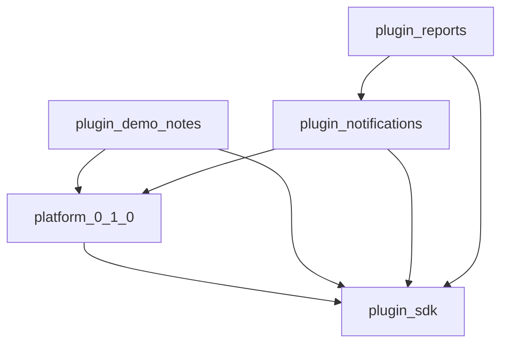

# 插件系统（Plugin System）

> 状态：设计基线  
> 相关：[ADR-001](../adr/001-plugin-runtime-model.md) · [仓库结构](./repository-structure.md) · [参考插件](../implementation/plugin-reference.md) · [契约与事件](./contracts-and-events.md)

## 1. 目标与边界

**目标**：业务能力以插件形式扩展，平台内核保持稳定。

**第一阶段边界（必须遵守）**：

- 仅支持**第一方编译期插件**（同 monorepo、同版本发布）。
- **不宣称**第三方沙箱、真正热插拔、独立二进制安装。
- 通过稳定 **Plugin SDK + Manifest + 贡献点** 为未来运行时扩展预留接口。

信任模型：插件代码与平台同等可信，质量靠 Code Review、CI、契约测试保障。

## 2. 插件包形态

```text
plugins/
  demo-notes/                 # 示例：@zen/plugin-demo-notes
    package.json              # name + "zen" manifest 字段 或 zen.plugin.json
    zen.plugin.json
    src/
      index.ts                # 聚合导出
      activate.ts             # 生命周期
      web/                    # 路由、菜单、组件贡献
      api/                    # Nest Module、controllers、services
      agent/                  # 可选：tools / graphs
      config.schema.ts        # 插件配置 Zod
    prisma/                   # 仅文档/片段；第一阶段合并进 apps/api schema
    tests/
```

包名约定：`@zen/plugin-<id>`，`id` 与 Manifest `id` 一致（无 scope 前缀时用 kebab-case）。

## 3. Manifest

统一使用 `zen.plugin.json`（Manifest **v2**）。权限、路由、API、配置与生命周期均为结构化字段；**无独立 menus**（导航由 routes 派生）。

```json
{
  "id": "demo-notes",
  "name": "演示便签",
  "version": "0.1.0",
  "platformVersion": "^0.1.0",
  "dependsOn": [],
  "permissions": [
    { "code": "demo:note:list", "name": "查看便签列表", "module": "demo" }
  ],
  "api": { "entry": "./src/api/demo-notes.module", "export": "DemoNotesModule" },
  "routes": [
    {
      "id": "demo-notes-home",
      "path": "/plugins/notes",
      "entry": "./src/web/pages/notes-page",
      "componentExport": "NotesPage",
      "title": "演示便签",
      "icon": "sticky-note",
      "order": 100,
      "permissions": ["demo:note:list"]
    }
  ],
  "config": { "entry": "./src/config.schema.ts", "schemaExport": "demoNotesConfigSchema" },
  "lifecycle": { "entry": "./src/lifecycle.ts", "export": "lifecycle" },
  "events": ["demo.note.created"]
}
```

包依赖方向：`shared/ui → plugin-sdk → plugins/* → plugin-registry → hosts`。`plugin:generate` 同时写出 SDK 注册表、`@zen/plugin-registry` loaders、以及 API/Web 宿主生成物。

### 校验规则（构建期）

| 规则 | 失败行为 |
|------|----------|
| `id` / `version` / `platformVersion` 必填 | 构建失败 |
| 目录名、`@zen/plugin-<id>` 包名与 Manifest.id 一致 | 构建失败 |
| 贡献入口存在且不逃逸插件目录 | 构建失败 |
| `dependsOn` 无环且可解析 | 构建失败 |
| 权限码符合命名规范且不与其他插件冲突 | 构建失败 |
| route path / id 唯一；icon 在允许列表 | 构建失败 |
| `platformVersion` 与当前平台兼容 | 构建失败 |
| `plugin:generate --check` 生成物无漂移 | CI 失败 |

## 4. 生命周期



| 阶段 | 含义 | 第一阶段实现 |
|------|------|--------------|
| discover | 扫描 `plugins/*` | turbo / 生成脚本枚举 |
| validate | Manifest + 依赖 | CI + `plugin-sdk` 校验器 |
| register | 注册贡献点到 Registry | 生成 `plugin-registry.gen.ts` |
| activate | 启用 | DB `plugin_installations.status=ACTIVE` + 运行时过滤 |
| deactivate | 停用 | 状态 Inactive；贡献点对请求不可见 |
| uninstall | 卸载 | **不自动回滚 schema**；仅停用并隐藏；物理删代码走发版 |

**数据策略**：停用保留数据；卸载不回滚表结构（ADR 级约束，见下文与 ADR-001）。

## 5. 贡献点（Contributions）

| 贡献点 | 宿主 | 说明 |
|--------|------|------|
| `permissions` | API Kernel | 种子权限；进权限树 |
| `routes` | Web Shell | TanStack 路由片段或注册表项 |
| `menus` | Web Shell | 或由 routes.meta 派生（推荐单源） |
| `widgets` | 工作台 | 卡片 / 快捷入口 |
| `apiModule` | API Kernel | NestJS `DynamicModule` 或静态 Module |
| `agentTools` | Agent Runtime | Tool 定义；执行走 API 授权 |
| `events` | 事件总线 | 订阅平台 / 插件事件 |
| `jobs` | 任务运行时 | Cron / 队列处理器（Phase 4） |
| `configSchema` | 配置中心 | Zod schema；存储于安装配置 Json |

### 菜单单源推荐

```text
Plugin routes.staticData
  + permissions filter
  → buildNavTree()
  → AppSidebar
```

禁止再维护独立硬编码 `sidebar-data` 全量树。

## 6. Plugin SDK 表面

`@zen/plugin-sdk` 提供（示意）：

```ts
export interface ZenPluginManifest { /* ... */ }

export interface PluginContext {
  tenantId: string
  config: unknown
  events: PluginEventBus
  logger: PluginLogger
}

export interface PluginModule {
  manifest: ZenPluginManifest
  activate?(ctx: PluginContext): Promise<void> | void
  deactivate?(ctx: PluginContext): Promise<void> | void
}

export interface ContributionRegistry {
  registerPermissions(pluginId: string, items: PermissionContribution[]): void
  registerRoutes(pluginId: string, routes: RouteContribution[]): void
  // ...
}
```

插件**只依赖** `@zen/plugin-sdk`、`@zen/shared`、`@zen/ui`（前端）、公开平台 API；禁止 `import` 其他插件 `src/**`。

## 7. 依赖与版本



- `dependsOn`：插件间 DAG；构建拓扑排序。
- `platformVersion`：semver range，对应当前平台版本。
- 共享库使用 `workspace:*`；对外契约 breaking change 走 major + CHANGELOG。

## 8. 数据库策略（第一阶段）

| 策略 | 选择 |
|------|------|
| Schema 所有权 | **集中式**：插件模型合并进 `apps/api/prisma/schema.prisma` |
| Migration | 统一 `prisma migrate`；PR 中由插件作者提交片段并由平台维护者合入 |
| 权限种子 | migration SQL 或 seed 脚本按插件 `permissions` 生成 |
| 安装表 | `plugin_installations(plugin_id, version, status, config, tenant_id)` |

未来若升级到运行时插件，再评估「插件自带 migration 聚合 CLI」；当前不实现。

## 9. 安全

即使第一方可信，仍强制：

1. 插件 API 必须挂 `PermissionGuard`
2. 列表查询必须走 `applyDataScope`（若资源有组织归属）
3. Agent Tool 不得直连 Repository 绕过 API 授权（推荐经 HTTP/OpenAPI）
4. 配置 schema 校验，拒绝未知键（可配置）
5. 启停操作写审计日志

## 10. 启停对运行时的影响

| 状态 | 路由/菜单 | API | Agent Tool | 数据 |
|------|-----------|-----|------------|------|
| ACTIVE | 可见（仍受权限过滤） | 注册 | 注册 | 可读写 |
| INACTIVE | 不可见 | 404 或 503（统一策略：模块不加载则 404） | 不注册 | 保留只读运维通道可选 |

第一阶段编译期：INACTIVE 通过「注册表过滤 + 可选条件导出」实现，无需动态卸载 JS。

## 11. 验收要点

- [ ] 非法 Manifest 无法通过 CI
- [ ] 参考插件不改 Shell 核心即可出现菜单与 API
- [ ] 停用插件后菜单消失且 API 不可用，表数据仍在
- [ ] 插件间循环依赖被拒绝
- [ ] 权限码冲突被拒绝
