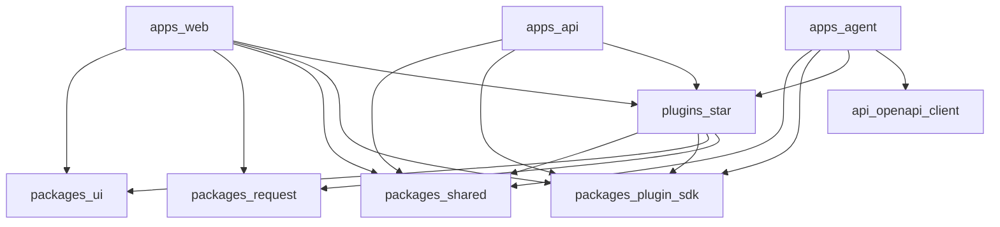

# 仓库结构（Repository Structure）

> 状态：设计基线  
> 相关：[平台总览](./platform-overview.md) · [插件系统](./plugin-system.md) · [实施路线](../implementation/roadmap.md)

## 1. 目标拓扑

在保持现有 `apps/*` + `packages/*` 的前提下，扩展为「平台包 + 插件目录」：

```text
zen/
├── apps/
│   ├── web/                 # Web Shell 宿主
│   ├── api/                 # API Kernel 宿主 + Prisma
│   └── agent/               # Agent Runtime 宿主
├── packages/
│   ├── shared/              # @zen/shared 契约
│   ├── ui/                  # @zen/ui
│   ├── request/             # @zen/request
│   ├── plugin-sdk/          # @zen/plugin-sdk（新建）
│   └── platform-*/          # 可选：抽出的内核库（按需渐进）
├── plugins/                 # 第一方编译期插件（新建）
│   └── demo-notes/          # @zen/plugin-demo-notes
├── docs/                    # 本设计文档
├── turbo.json
├── pnpm-workspace.yaml
└── package.json
```

### workspace 扩展

```yaml
# pnpm-workspace.yaml
packages:
  - "apps/*"
  - "packages/*"
  - "plugins/*"
```

## 2. 包职责

| 包 / 目录 | 职责 | 可被谁依赖 |
|-----------|------|------------|
| `apps/web` | Shell：布局、鉴权页、聚合插件路由 | 无（应用） |
| `apps/api` | Kernel：全局 Guard、Prisma、聚合插件 Module | 无（应用） |
| `apps/agent` | 聚合插件 tools/graphs | 无（应用） |
| `packages/shared` | Zod、权限码、DTO | 全部 |
| `packages/plugin-sdk` | Manifest、Registry、生命周期类型 | plugins、apps |
| `packages/ui` | 设计系统 | web、plugins（web） |
| `packages/request` | HTTP 管道 | web、plugins（web） |
| `plugins/*` | 业务 / 能力插件 | **仅** apps 聚合层；插件互不引用私有实现 |

## 3. 依赖方向



**禁止**：

- `plugins/A` → `plugins/B/src/...`（需要协作时：B 把契约升到 `@zen/shared` 或 B 的 public export，并在 Manifest `dependsOn` 声明）
- `packages/shared` → apps / plugins
- 插件直接依赖另一插件 Nest 内部 provider token（应经事件或公开 API）

## 4. 聚合方式（编译期）

### 4.1 生成注册表

构建或 codegen 步骤扫描 `plugins/*/zen.plugin.json`，生成：

```text
packages/plugin-sdk/src/generated/plugin-registry.gen.ts
# 或 apps/* 内各自 gen 文件
```

内容包括：插件列表、依赖序、Module 动态 import 列表、权限种子列表。

### 4.2 API 聚合示例

```ts
// apps/api/src/plugins.module.ts（示意）
@Module({
  imports: [
    ...activePluginModules, // 来自 registry，按 dependsOn 排序
  ],
})
export class PluginsModule {}
```

### 4.3 Web 聚合示例

- 插件导出 `routeTree` 片段或 `registerRoutes(registry)`
- Shell 在 root route 合并；`buildNavTree` 读 meta

### 4.4 Agent 聚合示例

- 合并 `agentTools`；`langgraph.json` graphs 由生成器维护或手工登记 + CI 校验一致性

## 5. 公开导出约定

每个插件 `package.json#exports` 仅暴露稳定入口：

```json
{
  "name": "@zen/plugin-demo-notes",
  "exports": {
    ".": "./src/index.ts",
    "./api": "./src/api/demo-notes.module.ts",
    "./web": "./src/web/index.ts",
    "./agent": "./src/agent/tools.ts",
    "./manifest": "./zen.plugin.json"
  }
}
```

禁止深度导入 `./src/api/internal/...`。

## 6. Turbo 任务

根 `turbo.json` 保持 package tasks；建议增加：

| 任务 | 说明 |
|------|------|
| `build` | 现有；插件需可 build 或被 JIT 消费 |
| `lint` / `check-types` | 全仓 |
| `test` | 各包自有；根 `turbo run test` |
| `plugin:validate` | Manifest + DAG + 权限冲突（可放 `packages/plugin-sdk`） |
| `codegen` | OpenAPI、plugin-registry |

`dependsOn: ["^build"]` 保证 shared / sdk 先于 apps。

根 `package.json` **只委托** `turbo run ...`，不写跨包 shell 逻辑。

## 7. Prisma 与插件

第一阶段：

- 唯一 schema：`apps/api/prisma/schema.prisma`
- 插件在 PR 中提交 schema 片段与 migration；平台维护者审查合入
- 文档中插件目录可放 `prisma/models.prisma.fragment.md` 作说明，**不**多 schema 运行

## 8. 边界检查

建议手段（Phase 0/2 落地）：

1. ESLint / Biome 限制 + `no-restricted-imports`
2. 可选 Turborepo boundaries / 依赖图检查脚本
3. CI 断言：`plugins/*` 不得出现相互相对路径 import

## 9. 与现状迁移

| 现状 | 目标 |
|------|------|
| `apps/web/src/features/system/*` | 短期可留在 app 内作为 kernel UI；稳定后可迁 `packages/platform-admin` 或保持 kernel |
| `features/bim`、`gis`、垂直 AI 场景 | 迁入 `plugins/*` 作为示范 / 业务插件 |
| 硬编码 `sidebar-data.ts` | 删除；改贡献点 / 路由派生 |
| 无 `plugins/` | Phase 2 创建；Phase 3 放入参考插件 |

## 10. 验收要点

- [ ] `pnpm-workspace` 含 `plugins/*`
- [ ] `@zen/plugin-sdk` 可被 apps 与 plugins 引用
- [ ] 依赖图无插件循环
- [ ] turbo build 在新增参考插件后仍绿
