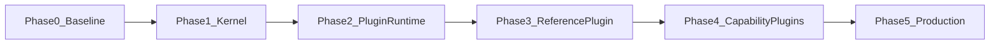

# 实施路线（Implementation Roadmap）

> 状态：设计基线  
> 相关：[功能清单](../product/feature-catalog.md) · [参考插件](./plugin-reference.md) · [仓库结构](../architecture/repository-structure.md)

本路线将平台建设拆为 Phase 0–5。每个阶段包含目标、工作包、依赖、交付物、测试门禁与 **Definition of Done（DoD）**。未满足 DoD 不得进入下一阶段主开发。

---

## 总览

| Phase | 主题 | 主要功能 ID（节选） |
|-------|------|---------------------|
| 0 | 基线治理 | OPS-01/02/05、AUDIT-05、OPEN-02 |
| 1 | 平台内核 | AUTH-*、USER-*、RBAC-*、ORG-*、NAV-*、CFG-01/02、AUDIT-* |
| 2 | 插件内核 | PLG-01..05、CFG-03 |
| 3 | 参考插件 | PLG-07、AI-02（可选） |
| 4 | 能力插件与 DX | NOTIF-*、JOB-*、PLG-06、OPEN-01；FILE-* 已归内核 |
| 5 | 生产化与条件演进 | 容器、观测、RBAC-08+、TENANT-*、PLG-08 |

---

## Phase 0 · 基线治理

### 目标

让仓库具备可重复构建、可测试、可契约校验的工程底座。

### 工作包

1. 统一 `.gitignore`：排除 `dist/`、生成客户端（或明确生成策略）、本地 env
2. 建立 CI：`lint`、`check-types`、`build`（`turbo run`）
3. 引入测试运行器：api Jest/Vitest、web Vitest；至少一个冒烟测试
4. OpenAPI：**全量 Module** 进入 Swagger；生成物流程文档化
5. 请求 `traceId` 中间件 / 拦截器
6. 文档门禁：`docs/` 链接存在性抽查（可先手工清单）

### 依赖

无。可与文档编写并行（本文档集即输入）。

### 交付物

- CI workflow
- 测试脚本接入 turbo `test`（若新增）
- OpenAPI 全覆盖检查说明
- 健康检查可用

### 测试门禁

- `turbo run lint check-types build` 通过
- 健康检查返回成功

### DoD

- [x] 主分支 CI 绿（见 `.github/workflows/ci.yml`）
- [x] 无必要构建产物进入版本控制（策略明确）
- [x] Swagger 包含当前全部业务 Module（移除 include 白名单 + `OPENAPI_REQUIRED_MODULE_NAMES` 门禁）
- [x] 日志或响应可观测到 `traceId`

---

## Phase 1 · 平台内核

### 目标

交付可安全托管业务的身份、组织、RBAC+DataScope、菜单壳与审计。

### 工作包

1. **Tenant Context**：默认租户种子；请求上下文注入
2. **Auth**：登录/刷新/登出、Session、锁定、登录日志
3. **User + Membership** 模型落地（可先 1:1 简化 API）
4. **Organization 单树** + path 维护；成员主职兼职；岗位
5. **RBAC**：PermissionGuard、角色权限、用户角色、权限码常量进 `@zen/shared`
6. **DataScope**：`applyDataScope` 统一过滤；至少在用户/某一资源验证
7. **导航单源**：路由 meta → `buildNavTree`；移除硬编码全量 sidebar
8. **前端 beforeLoad** 权限；按钮级 `Can`
9. **配置 / 字典** 最小集
10. **操作审计** 写入 API
11. 合并或废弃并行 Department（迁移计划 + 执行）

### 依赖

Phase 0 完成。

### 交付物

- 内核 API 与管理页（用户、角色、组织、字典、审计查询）
- 领域与安全实现与 [domain-and-security](../architecture/domain-and-security.md) 对齐
- 权限变更缓存失效机制

### 测试门禁

- 集成测试：无权限 403；DataScope SELF 隔离
- 前端路由无权限不可进入
- 关键用例：调岗后数据范围变化

### DoD

- [x] Phase 1 内核 P0 主路径闭环：AUTH-01/02/04、USER-01、RBAC-01..07、ORG-01..04/06、NAV-01/04、CFG-01/02、AUDIT-01（管理页 + API）
- [x] AUTH-05/06、USER-04/05、ORG-05、NAV-02、AUDIT-02/04 已补齐（限流 + 登录历史 + 重置/强制改密 + 外链；NAV-03 页签/面包屑按产品决定暂不启用）
- [x] MFA（ME-04 TOTP）、AUDIT-03 step-up（删除用户）已落地；轻量 i18n store 可用
- [x] 无硬编码双源菜单（路由 `staticData` → `buildNavGroupsFromRoutes`；已删除 `sidebar-data`）
- [x] Department 双树问题已消除（见 [department-deprecation](../migration/department-deprecation.md)）
- [x] 审计可查权限变更（`AuditLog` + 角色赋权 / 组织变更写入）；登录审计沿用 UserAudit + LoginEvent

### 本批已交付

- `@zen/shared`：`PermissionCode` / `AuthContext` / 权限判断工具 / Organization / Dict schema
- Prisma：`Tenant`、`AuditLog`、`DictType`/`DictItem`、`Session`、`Membership`、`Post`；Department 表已删除
- 后端：AuthContext + PermissionGuard；Session 列表/撤销；Membership；Organization CRUD/树/成员/岗位；DataScope；Dict / Audit API；角色赋权 `permVer` bump + 相关会话失效
- 前端：用户/角色/组织（含成员岗位）/会话/字典/审计；菜单单源；路由权限 beforeLoad；`Can` 组件

---

## Phase 2 · 插件内核

### 目标

落地编译期插件运行时：SDK、Manifest、注册表、启停、贡献点。

### 工作包

1. 新建 `packages/plugin-sdk`
2. 扩展 workspace `plugins/*`
3. Manifest JSON Schema + `plugin:validate`
4. 生成 `plugin-registry.gen.ts`；API/Web/Agent 聚合
5. `plugin_installations` 表（tenantId、status、config）
6. 贡献点 Registry：permissions / routes / apiModule / …（按优先级先 permissions+routes+api）
7. activate / deactivate API（超管）+ 审计
8. Feature Flag 与插件 configSchema 存储

### 依赖

Phase 1（权限与菜单机制必须先存在）。

### 交付物

- `@zen/plugin-sdk`
- 校验 CLI / turbo task
- 插件启停管理 API（UI 可简易）
- 文档：[plugin-system](../architecture/plugin-system.md) 与实现一致的 README 片段

### 测试门禁

- 非法 Manifest CI 红
- 环依赖 CI 红
- 权限码冲突 CI 红
- 单元测试：registry 注册与过滤

### DoD

- [x] PLG-01..05 主路径验收：Manifest 校验、注册表生成、启停、贡献点过滤、插件 config/Feature Flag 读写
- [x] 空插件目录或示例 stub 可被发现并校验（`plugins/hello-stub`）
- [x] 停用状态可阻止贡献点暴露（即使代码仍在仓内）（`filterActiveRegistryEntries` / `ContributionRegistry`）
- [x] ContributionRegistry 覆盖 widgets/events/jobs 只读聚合（运行时消费仍可按产品演进）

### 本批已交付

- `@zen/plugin-sdk`：Manifest Zod、discover/validate/topo-sort、ContributionRegistry、`zen-plugin` CLI
- workspace：`plugins/*`；stub `hello-stub`；参考插件 `demo-notes`（Phase 3）
- 生成：`plugin-registry.gen.ts`；根脚本 `plugin:validate` / `plugin:generate` / `plugin:create`
- Prisma：`PluginInstallation`；启停 + `PATCH /plugins/:id/config`；`PluginsModule` 聚合壳
- 前端：插件管理页（启停 / JSON 配置）；站点级 Feature Flag（CFG-03 轻量）
- 权限码：`system:plugin:list|manage`

---

## Phase 3 · 参考插件

### 目标

用一个最小业务插件证明扩展路径可复制。详见 [plugin-reference](./plugin-reference.md)。

### 工作包

1. 创建 `@zen/plugin-demo-notes`（或团队选定的参考域）
2. 贡献：权限、菜单路由、CRUD API、配置项、领域事件
3. 可选：一个 Agent Tool + Tool UI
4. Prisma 模型合入平台 schema + migration + 权限种子
5. 契约测试与 e2e 冒烟

### 依赖

Phase 2。

### 交付物

- 参考插件源码与开发者笔记
- 「创建插件」检查清单（为 Phase 4 脚手架输入）

### 测试门禁

- e2e：有权限可 CRUD；无权限 403；停用插件后入口消失
- OpenAPI 含插件 tag

### DoD

- [x] PLG-07 参考路径可用（demo-notes CRUD + 权限 + DataScope + 启停）
- [x] 未修改 Shell 核心业务逻辑，仅聚合注册表/生成物与薄路由封装
- [x] 文档中的参考流程与仓库一致（见 plugin-reference）
- [x] 领域事件最小总线 + 权限单测；完整 Playwright e2e 仍可选后续补齐

### DoD（Phase 4 提前项）

- [x] PLG-06 脚手架最小命令：`pnpm plugin:create <id>`

### 本批已交付

- `plugins/demo-notes`：Manifest、Nest API（DynamicModule）、Web `NotesPage`、config schema
- Prisma：`DemoNote` + 权限种子 + 默认安装 ACTIVE
- 宿主：`PluginsModule` 聚合、`PluginActiveGuard`、`GET /plugins/active-ids`
- Web：`/_authenticated/demo/notes` 薄路由；侧边栏按 `pluginId` + 启用状态过滤

---

## Phase 4 · 能力插件与开发者体验

### 目标

通知、文件、任务等按插件交付；补齐脚手架与契约测试。

### 工作包

1. `plugin-notifications`、`plugin-jobs`（可分批）；文件上传已上收内核（ADR-003）
2. Webhook 出站插件（可选批次）
3. `create-plugin` 脚手架（Manifest + 目录模板）
4. 工作台 widget 贡献点落地
5. AI 调用审计（若启用 Copilot）
6. 导出类能力统一走任务中心

### 依赖

Phase 3（模板验证后批量复制）。

### 交付物

- 至少一个能力插件生产可用
- 脚手架文档与命令
- 插件开发指南（可放 `docs/guides/` 后续追加）

### 测试门禁

- 各能力插件独立集成测试
- 脚手架生成物通过 `plugin:validate`

### DoD

- [x] NOTIF/FILE/JOB 三条产品线最小验收：API + Web 薄路由 + 权限 + 启停过滤
- [x] PLG-06 可用（`pnpm plugin:create` 最小脚手架）
- [x] 新插件从脚手架到挂载路径已文档化（见 [create-plugin](../guides/create-plugin.md)）

---

## Phase 5 · 生产化与条件演进

### 目标

可上线运维；仅在触发条件满足时引入 Redis/队列/运行时插件/完整多租户。

### 工作包

1. Dockerfile / compose；配置十二要素
2. 指标、告警、错误追踪
3. 备份恢复演练；迁移 runbook
4. 性能与安全测试（含越权、IDOR、租户隔离抽查）
5. **条件项**（见下表）再立项：Redis、队列、Outbox、运行时加载、租户管理 UI、SSO、JIT 角色等

### 触发条件

| 演进项 | 触发条件 |
|--------|----------|
| Redis / 集中 Session | API ≥2 实例且需即时撤销 |
| 队列 | 异步任务 P95 或积压超过 SLA |
| Outbox | 需要跨进程至少一次投递 |
| 运行时热插拔 | 需要独立发版插件且不改平台镜像；见 ADR-001 |
| 完整多租户 | 明确 SaaS 商务需求；见 ADR-002 |
| SSO | 企业 IdP 对接需求立项 |

### DoD

- [x] 一键（或文档化）部署到预发：`docker-compose.yml` + [runbook](../ops/runbook.md)
- [x] 故障演练：回滚、DB 恢复、密钥轮换（见 runbook）
- [x] 安全检查清单：[security-checklist](../ops/security-checklist.md)
- [x] 条件项未提前盲目实现（Redis/完整多租户/热插拔仍按触发条件）
- [x] 基础观测：`GET /api/metrics`（进程内存与 uptime）

---

## 跨阶段工程原则

1. **先契约后功能**：shared schema / 权限码先行
2. **先授权后页面**：Guard 与 DataScope 先于炫酷 UI
3. **插件只加能力不加内核分叉**：内核变更走 ADR
4. **DoD 重于燃尽图**：阶段完成以验收清单为准
5. **文档同步**：行为变更必须更新 `docs/` 对应页

---

## 进度追踪建议

在项目管理工具中为每个 Phase 建 Epic，将功能清单 ID（如 `RBAC-06`）作为 Story 标签，与本路线 DoD 勾选同步。
